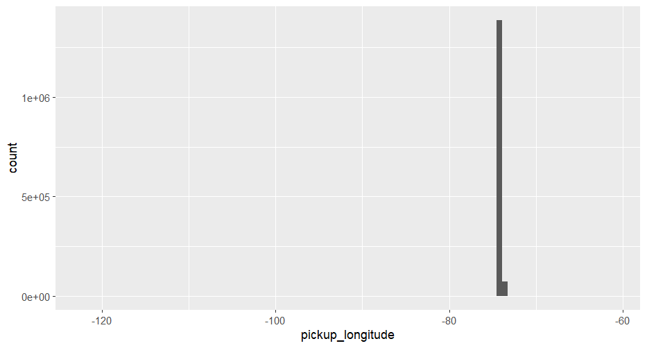
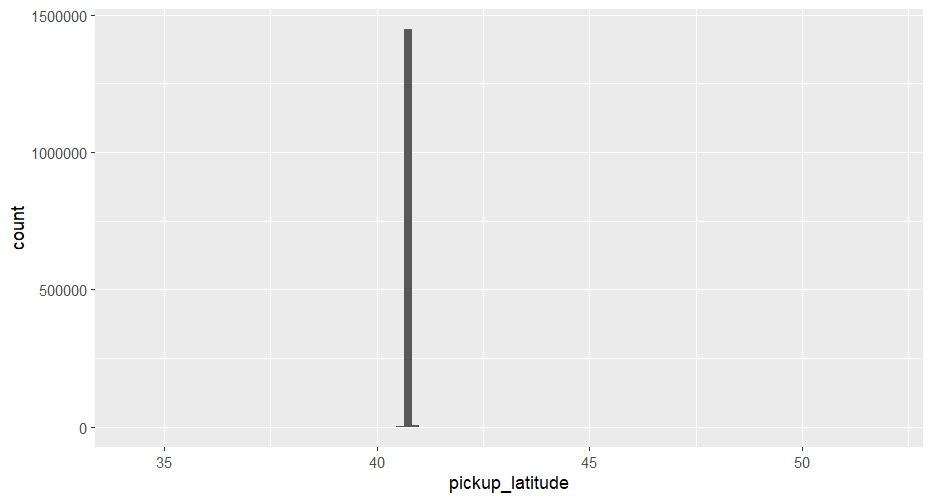
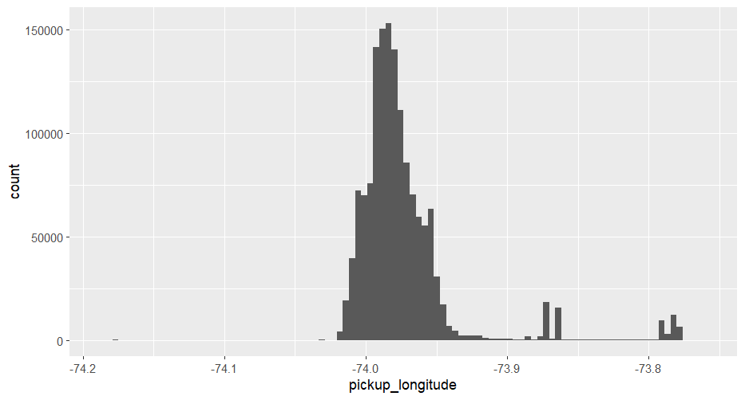
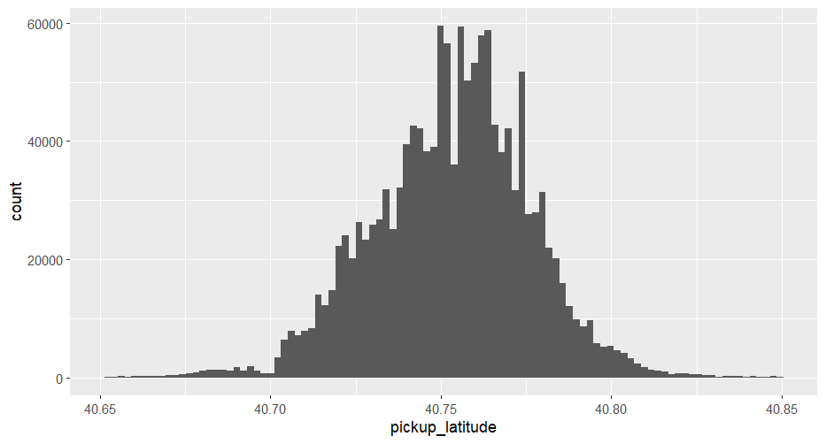
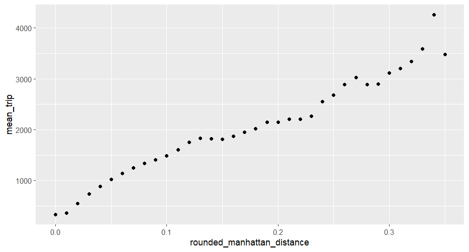
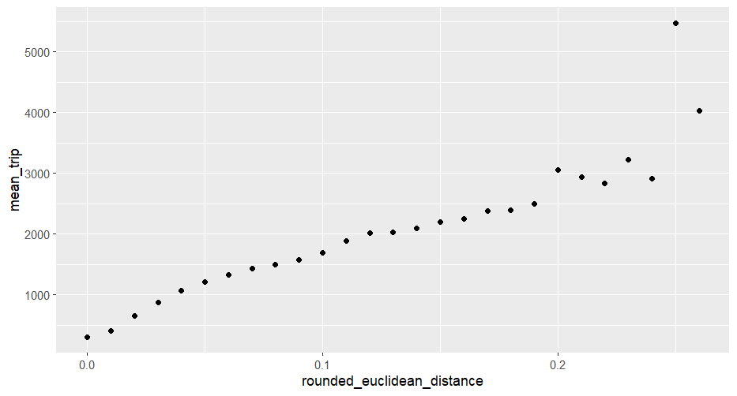
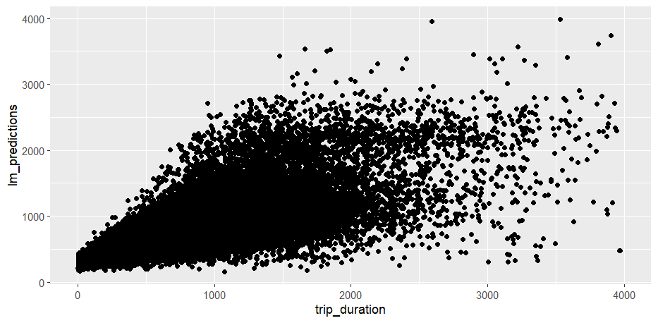
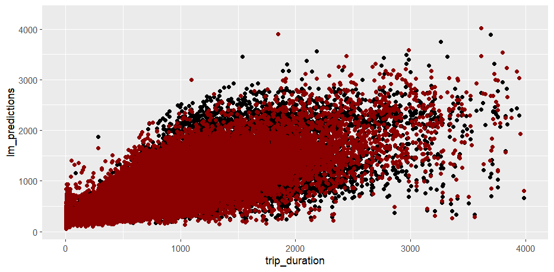

# R_Kaggle_Taxi_Trip_Duration_Project

## Project Overview
This project focuses on predicting the duration of taxi trips in New York City using historical taxi trip data. The task is framed as a supervised machine learning regression problem, where the objective is to estimate how long a taxi ride will take from a pickup location to a dropoff location based on multiple explanatory variables.

The project emphasizes real-world data challenges such as noisy geographic information, outlier detection, and feature preparation prior to modeling.

**Main Question:**  
- *How long will it take for a taxi to travel from the pickup spot to the dropoff spot?*
- 
---

## Dataset
The dataset used in this project was retrieved from Kaggle and contains detailed trip-level data for NYC taxi rides.

**Data source:**  
https://www.kaggle.com/datasets/yasserh/nyc-taxi-trip-duration

Due to the large size of the dataset, the raw files are not uploaded to this GitHub repository. Users can download the data directly from Kaggle.

**Dataset highlights:**
- NYC taxi trip records
- Temporal, geographic, and passenger information
- Target variable: `trip_duration` (in seconds)

---

## Evaluation Metric
Kaggle evaluates this dataset using **Root Mean Squared Logarithmic Error (RMSLE)**.  
In this project, **Root Mean Squared Error (RMSE)** is used instead, as it is closely related and well-suited for regression problems involving continuous target variables.

---

## Project Scope
- Data loading and inspection  
- Data preprocessing  
- Exploratory data analysis (EDA)  
- Feature engineering  
- Machine learning modeling  
- Model evaluation  

---

## Libraries & Packages
The project is implemented in **R** and relies on the following libraries:
- `readxl`
- `ggplot2`
- `dplyr`
- `caret`
- `mltools`

---

## Data Description
The dataset contains **11 variables**:

- `id` – Unique trip identifier  
- `vendor_id` – Taxi vendor identifier  
- `pickup_datetime` – Date and time of pickup  
- `dropoff_datetime` – Date and time of dropoff  
- `passenger_count` – Number of passengers  
- `pickup_longitude` – Longitude of pickup location  
- `pickup_latitude` – Latitude of pickup location  
- `dropoff_longitude` – Longitude of dropoff location  
- `dropoff_latitude` – Latitude of dropoff location  
- `store_and_fwd_flag` – Indicator for data storage method  
- `trip_duration` – Duration of the trip (target variable)

---

## Exploratory Data Analysis (EDA)

### (Geographic) Variables and Outliers
The EDA begins with an exploration of the geographic variables. **Pickup longitude** and **pickup latitude** are presented below as representative examples, as they clearly illustrate the presence of extreme outliers in the dataset.

In both cases, the initial distributions show a wide scale with the majority of observations concentrated within a narrow range. A small number of extreme values fall far outside this range.

By manually inspecting these extreme observations and verifying them using mapping tools, it becomes evident that they correspond to locations outside the New York City area and therefore do not represent valid NYC taxi trips.

### Pickup Longitude Distribution

### Pickup Latitude Distribution
A similar issue is observed for **pickup latitude**, where several observations fall well outside the expected NYC latitude range.

---

### Outlier Treatment Methodology
To address these issues systematically, outliers were handled using a **distribution-based approach** rather than manual or hard-coded boundaries.

For each relevant variable (including geographic variables and additional fields such as `trip_duration`), the **mean** and **standard deviation** were calculated. Observations falling far outside the expected distribution were removed by filtering values beyond a defined standard deviation threshold from the mean.

This approach ensures:
- Consistent treatment across all variables  
- Objective identification of extreme values  
- Removal of non-representative observations without relying on fixed thresholds  

After applying this method, the cleaned variables followed approximately normal distributions, confirming that the remaining observations represent realistic and reliable taxi trips.

### Distributions After Outlier Removal
After applying the outlier removal process, the geographic variables exhibit well-behaved distributions consistent with realistic NYC taxi trips.

### Pickup Longitude Distribution (After Cleaning)

### Pickup Latitude Distribution (After Cleaning)

---

## EDA Summary
After completing the outlier detection and removal process, approximately **6% of the original dataset** was removed.

This cleaning step significantly improves data quality and prepares the dataset for effective feature engineering and machine learning modeling.

---

## Feature Engineering

### Temporal Features
The `pickup_datetime` column contains both date and time information. To make this data useful for modeling, it was decomposed into separate features:

- **Month** – captures seasonal trends in trip duration  
- **Day** – allows exploration of day-of-month effects  
- **Hour** – captures time-of-day patterns, including rush hours and quieter periods  
- **Weekday** – identifies differences between weekdays and weekends  

By breaking down the datetime into these components, repeatable temporal patterns can be captured, which helps models better estimate trip durations.

Analysis of mean trip duration by these temporal features revealed clear patterns:

- **Month:** Trip duration gradually increases over the first six months of the year, from 718 seconds in January to 803 seconds in June.
- **Day:** Slight variations are observed across days of the month, reflecting local events or traffic variations.  
- **Hour:** Trips during morning and evening rush hours tend to have longer durations compared to off-peak hours.  
- **Weekday:** Weekdays exhibit higher mean trip durations than weekends, likely due to heavier traffic from commuting.

  
- Weekday vs Trip Duration:  

---

### Spatial Features

To capture the effect of trip distance on duration, two distance-based features were calculated using the pickup and dropoff coordinates:

1. **Manhattan Distance** – the sum of absolute differences in latitude and longitude, approximating the distance taxis travel along the street grid. This reflects real-world city navigation more accurately than a straight line.  
2. **Euclidean Distance** – the straight-line distance between pickup and dropoff points, used as a simple baseline feature.

**Correlation with Trip Duration:**

- Manhattan Distance: 0.699  
- Euclidean Distance: 0.710  

These high positive correlations indicate that both distance features are strongly predictive of trip duration. Visualizations further confirm the expected trend: longer trips correspond to longer durations.

**Visualizations:**

- Manhattan Distance vs Trip Duration  
    

- Euclidean Distance vs Trip Duration  
     

**Feature Considerations:**

- Both distance features are strongly correlated with each other, so care must be taken when using linear models to avoid multicollinearity.  
- Tree-based models, such as Random Forest, are less sensitive to correlated features, allowing both distances to be used for comparison purposes.

---

These temporal and spatial features form a strong foundation for predictive modeling, capturing key patterns related to time, traffic, and distance in NYC taxi trips.

--- 

## Modeling & Evaluation

### Categorical Variable Encoding
Most machine learning algorithms require numerical inputs. To handle the categorical variable `pickup_weekday`, **one-hot encoding** was applied. Each weekday was converted into a separate binary feature (e.g., Monday = 1, all other days = 0), allowing the model to capture the effect of each day independently without introducing artificial ordinal relationships.

---

### Train-Test Split
The dataset was split into training and test sets to evaluate model performance on unseen data. A fixed percentage of observations was randomly sampled to form the training set, while the remaining data formed the test set. A fixed random seed ensured reproducibility of the split.

---

### Linear Regression Model
A multiple linear regression model was trained using all available features:

- Temporal features: month, day, hour, weekday  
- Spatial features: Manhattan and Euclidean distances  
- Passenger count and vendor ID  

**Results on the test set:**

- **R-squared:** 0.528  
- **Root Mean Squared Error (RMSE):** 365.14 seconds (~6.08 minutes)  

All features were statistically significant except for `vendor_id` (p-value ≈ 0.081), which had minimal influence on the model. The model did not show signs of overfitting, and the predictions generally aligned well with the true trip durations.  

Visualization of predicted vs actual values shows a reasonable fit, with most points following the diagonal, although some high-duration trips remain harder to predict accurately.

### Linear Model Predictions (Sample of 5,000 Trips)
The scatter plot below shows predicted vs. actual trip durations for a sample of 5,000 observations using the linear regression model. Most predictions align along the diagonal, though longer trips are more challenging to predict accurately.

---

### Random Forest Model
A Random Forest regression model was also trained to account for potential nonlinear relationships and interactions between features. Tree-based models are less sensitive to correlated inputs (e.g., Manhattan vs Euclidean distance) and often provide better predictive performance.

**Results on the test set:**

- **R-squared:** 0.632  
- **Root Mean Squared Error (RMSE):** 323.10 seconds (~5.38 minutes)  

Comparing to the linear model, the Random Forest achieved higher R-squared and lower RMSE, indicating improved predictive accuracy. Visualization of predicted vs actual trip durations shows a tighter fit along the diagonal line, confirming the superior performance of the Random Forest for this dataset.

### Predicted vs Actual Trip Duration (Sample of 5,000 Trips)
The scatter plot below shows predicted vs. actual trip durations for a sample of 5,000 observations:

- **Black points:** Linear Regression predictions  
- **Red points:** Random Forest predictions  

The Random Forest model (red) more closely follows the diagonal line, indicating a better fit, particularly for longer trips. This visualization highlights the improved predictive performance of the Random Forest compared to the linear model.

---

### Summary
- **Linear Regression:** Simple and interpretable, explains 52.8% of variance, RMSE ≈ 6.08 minutes  
- **Random Forest:** Handles nonlinearities and interactions, explains 63.2% of variance, RMSE ≈ 5.38 minutes  

Overall, the Random Forest model outperforms linear regression for predicting NYC taxi trip durations, particularly for longer trips and complex temporal-spatial patterns. Both models, however, provide valuable insights into how features such as time of day, day of the week, and distance influence trip duration.

